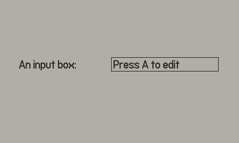

# Port of Keyboard API

## How to use?
See API here: [API.md](API.md).

Keyboard expects you to have the following assets inside your `Source` folder:

- CoreLibs/assets/keyboard/menu-cancel.png
- CoreLibs/assets/keyboard/menu-del.png
- CoreLibs/assets/keyboard/menu-ok.png
- CoreLibs/assets/keyboard/menu-space.png
- CoreLibs/assets/keyboard/Roobert-24-Keyboard-Medium-table-36-36.png
- CoreLibs/assets/keyboard/Roobert-24-Keyboard-Medium.fnt
- CoreLibs/assets/sfx/click.wav
- CoreLibs/assets/sfx/denial.wav
- CoreLibs/assets/sfx/key.wav
- CoreLibs/assets/sfx/selection-reverse.wav
- CoreLibs/assets/sfx/selection.wav

You can find them in the SDK inside the `CoreLibs` folder.

Some gotcha:

- In Lua, the keyboard take over the system callback and call yours automatically. There is no `getUpdateCallback` in the C API so you have to call `keyboardApi.setPlaydateUpdateCallback` on every keyboard instances.
- Same thing for the refresh rate. You have to call `keyboardApi.setRefreshRate` if you are using something other than 30 fps.

## Demo

`demo` folder contains a short sample using this API. It can be compiled using the provided Makefile (sorry no CMakeFile at the moment).

You should compile using `make` or `make all` to ensure that the `copy_images` rule is called. This will copy the necessary assets from the SDK.
